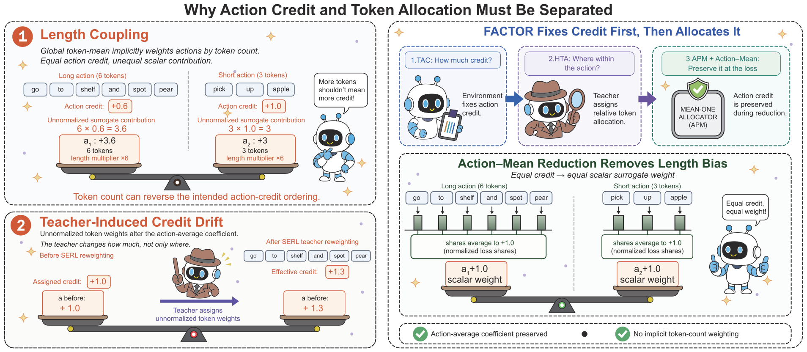

<div align="center">

# How Much, Then Where: Credit-Conserving Action-to-Token Allocation for Multi-Turn Agent Reinforcement Learning

**FACTOR** (factorizing action credit and token responsibility) — Official Implementation

[](https://arxiv.org/abs/2608.07118)
[](LICENSE)

</div>

## 📖 Abstract

Credit assignment in multi-turn agent reinforcement learning operates at two levels: assigning trajectory-level credit to actions, and distributing each action's credit across its tokens. Existing methods couple these two decisions, so an action's effective update scale drifts with incidental factors—response length and teacher confidence—rather than with what the environment actually observed.

We introduce **FACTOR**, which separates these decisions through an explicit conservation interface. FACTOR uses checkpoint-calibrated TD residuals to assign per-action credits that telescope exactly to the trajectory advantage, and feedback-conditioned teacher–student likelihood gaps to allocate each credit across the realized action tokens. Per-action normalization preserves the action-average coefficient and prevents token-level sign flips, and an action-mean reduction removes the implicit dependence of an action's surrogate weight on its token length. At the behavior policy and before clipping, each action's inner action-mean surrogate equals exactly its TD credit. FACTOR consistently improves over competitive baselines across ALFWorld, WebShop, and ScienceWorld, with every environment-seed comparison favoring FACTOR and the largest gains emerging on the longest-horizon environment. The same hyperparameters transfer without retuning to a larger backbone and to a different model family.

## 🎯 Key Contributions

- **Conservation interface**: We identify the loss reduction itself as part of the action-to-token credit interface, and show that pairing per-action mean-preserving allocation with an action-mean surrogate yields a precise property: each action's pre-clipping surrogate value at the behavior policy equals exactly its assigned credit.
- **Three lightweight components**: Checkpoint-calibrated TD credit (TAC), hindsight likelihood-gap allocation (HTA), and per-action mean-preserving normalization (APM) — modifying only executable-action token coefficients while leaving the auxiliary distillation loss untouched.
- **Consistent empirical gains**: FACTOR improves over competitive baselines on ALFWorld, WebShop, and ScienceWorld (all 9 seed×environment comparisons favor FACTOR), with the largest gains on the longest-horizon environment; the same hyperparameters transfer without retuning across backbones and model families.

## 🎨 Overview

<div align="center">
  
  <p><em>Figure 1: Why action credit and token allocation must be separated. Left: two failure modes of coupled credit — length coupling (top) inflates long actions' surrogate contribution, while teacher-induced drift (bottom) changes the action-average coefficient. Right: FACTOR fixes credit first (TAC), then allocates within each action (HTA), preserving the action mean at the loss level (APM + action-mean reduction).</em></p>
</div>

<div align="center">
  
  <p><em>Figure 2: Overview of FACTOR's two-stage credit-then-allocation pipeline (TAC–HTA–APM).</em></p>
</div>

## 🚀 Quick Start

### Installation

FACTOR is built on the [verl](https://github.com/volcengine/verl)/SERL framework (commit `b338174`, `serl_action_mask` branch).

```bash
git clone https://github.com/Super-MariOvO/FACTOR.git
cd FACTOR
pip install -e .
```

### Running FACTOR

```bash
# Training (one run per seed: 42, 43, 1337)
python scripts/train_factor.py --env alfworld --seed 42 \
    --output runs/factor_alfworld_s42

# Evaluation (greedy decoding, held-out splits)
python scripts/evaluate.py --env alfworld \
    --checkpoint runs/factor_alfworld_s42/final
```

### Key Configuration Parameters

```yaml
factor:
  B: 2          # continuations sampled per anchor (inference-only)
  M: 4          # continuation length (tokens/actions horizon)
  d: 3.0        # checkpoint drift threshold (L2) / HTA clip bound
  tau: 1.0      # HTA softmax temperature
  eta_0: 0.7    # initial teacher-concentration weight
  eta_schedule: "eta_0 * max(1 - k/50, 0)"   # active during steps 11-49
  value_warmup: 10    # steps 1-10: value head warmup only
  polyak: 0.995       # EMA decay for the target value head
```

**Hyperparameter Guidelines:**
- **Default recipe**: `B=2, M=4` sits at the saturation knee of the continuation budget — larger budgets add cost without measurable gain.
- **Backbone**: Qwen2.5-7B-Instruct; context 4096, generation 512.
- **Training**: 150 steps, group size 8, batch size 128 trajectories, rollout temperature 1.0, one PPO epoch, Adam lr `5e-7`, grad clip 1.0, clip eps 0.2.

### Environments

| Environment  | Split                                   | Max turns | Notes            |
|--------------|-----------------------------------------|-----------|------------------|
| ALFWorld     | 134 unseen games, 6 categories          | 50        | v0.3.2           |
| WebShop      | 1000 held-out instructions              | 15        | greedy eval      |
| ScienceWorld | 540 episodes (30 tasks × 3 lvls × 6)    | 50        | v1.1             |

Each wrapper exposes `reset() / step() / render_context()` and tracks turns so the rollout worker can segment token streams into actions and build the feedback-visible teacher context.

## 📊 Experimental Results

### Main Results

Success rate (%) on ALFWorld, WebShop, and ScienceWorld (Qwen2.5-7B, action-mean reduction, 3 seeds):

| Method | Pick | Look | Clean | Heat | Cool | Pick2 | **ALF Macro** | **WebShop** | **SciWorld** |
|--------|------|------|-------|------|------|-------|----------|----------|----------|
| PPO† | 92.3 | 64.0 | 92.5 | 89.5 | 80.3 | 68.8 | 81.2 | 68.7 | — |
| GRPO | 88.9 | 83.3 | 83.9 | 71.0 | 68.3 | 56.9 | 75.4 ± 1.2 | 64.3 ± 1.4 | 35.5 ± 1.3 |
| GiGPO† | 93.5 | 83.3 | 78.9 | 86.7 | 76.2 | 85.0 | 83.9 | 75.8 | 34.8 |
| HGPO† | 92.3 | 91.7 | 77.8 | 93.3 | 85.7 | 73.9 | 85.8 | 77.8 | — |
| RLSD† | 97.4 | 75.0 | 88.9 | 100.0 | 61.9 | 73.9 | 82.9 | 75.8 | — |
| SERL-Repro | 94.4 | 94.4 | 90.3 | 97.1 | 76.2 | 86.3 | 89.8 ± 1.1 | 80.0 ± 1.5 | 44.7 ± 1.2 |
| **FACTOR (Ours)** | **94.4** | **100.0** | **91.4** | **98.6** | **79.4** | **88.2** | **92.0 ± 0.5** | **82.4 ± 0.6** | **48.9 ± 0.8** |

**Key Findings:**
- **Consistent improvement**: FACTOR improves over the controlled SERL-Repro baseline by **+2.2** (ALFWorld), **+2.4** (WebShop), and **+4.2** pp (ScienceWorld) — the largest gain on the longest-horizon environment.
- **Statistical evidence**: all 9 seed×environment comparisons favor FACTOR, and FACTOR reports lower across-seed standard deviation on all three benchmarks.
- **ALFWorld categories**: improves five of six categories and ties on Pick, with the largest category-level gain on Look (+5.6 pp).
- † denotes published results under different protocols, included only for context. **Bold** marks the best controlled result. Pick2 abbreviates PickTwo.

### Training Dynamics

The advantage persists through training: late-training normalized reward reaches **0.56** for FACTOR, compared with **0.45** for SERL-Repro and **0.47** for the compute-matched 188-step SERL-Extended run — the gain is not confined to a single checkpoint.

### Transferability

The same hyperparameters transfer **without retuning** to a larger backbone and to a different model family (see paper Table 3 for cross-backbone transfer results).

## 🔬 Algorithm Overview

### Core Idea

For each executed action $t$ with $L_t$ tokens, FACTOR factorizes the PPO token coefficient as:

$$
C_{t,j}^{\mathrm{FACTOR}} = \omega_{t,j}\,A_t^\star = L_t\,\rho_{t,j}\,A_t^\star
$$

1. **TAC** determines *how much* credit $A_t^\star$ an action deserves — independent of token count or teacher confidence.
2. **HTA + APM** determine *where* that fixed budget lands across tokens — constrained to never revise the first answer.

### TAC: TD Action Credit

TAC replaces the single trajectory-level advantage (broadcast identically to every action) with a per-action TD decomposition. With the boundary-adjusted potential

$$
\widetilde V_{\bar\phi}(x_{i,t}) =
\begin{cases}
b_i, & t=0,\\
V_{\bar\phi}(x_{i,t}), & 0<t<T_i,\\
0, & t=T_i,
\end{cases}
$$

the per-action credit is

$$
A_{i,t}^\star = r_{i,t} + \widetilde V_{\bar\phi}(x_{i,t+1}) - \widetilde V_{\bar\phi}(x_{i,t}),
\qquad
\sum_{t=0}^{T_i-1} A_{i,t}^\star = G_i - b_i = A_i^{\mathrm{seq}}.
$$

The credits **telescope exactly** to the trajectory advantage — an accounting identity that holds independent of value-head accuracy. The value head (2-layer MLP, hidden 1024, GELU) is calibrated from Monte Carlo returns of `B=2` short inference-only continuations (length `M=4`) sampled under the frozen behavior policy from drift-selected checkpoints, with a Polyak target head (EMA 0.995) and a 10-step replay buffer.

### HTA: Hindsight Token Allocation

The teacher $\pi_T$ is a frozen copy of the current policy, re-scored with the environment feedback $\Phi_t$ visible. The hindsight likelihood gap per token

$$
\Delta_{t,j} = \log \pi_T(a_j \mid x_t, \Phi_t) - \log \pi_\theta(a_j \mid x_t)
$$

is turned into an outcome-aligned score:

$$
s_{t,j} = \mathrm{sgn}(A_t^\star)\,\mathrm{clip}(\Delta_{t,j}, -d, d)
$$

When $A_t^\star > 0$, tokens with higher $\Delta_{t,j}$ receive more positive credit; when $A_t^\star < 0$, tokens with lower $\Delta_{t,j}$ bear more negative credit. The teacher determines *relative allocation*; the environment, through $A_t^\star$, determines *direction and magnitude*.

### APM: Per-Action Mean Preservation

APM normalizes the allocation so the teacher cannot create, scale, or flip the action-average coefficient:

$$
\rho_{t,j} = (1-\eta_k)\frac{1}{L_t} + \eta_k\,\mathrm{softmax}_j\!\Bigl(\frac{s_{t,j}}{\tau}\Bigr),
\qquad
\sum_j \rho_{t,j} = 1,\quad \rho_{t,j} \ge 0
$$

with the mean-one multiplier $\omega_{t,j} = L_t \rho_{t,j}$. Mean preservation follows immediately: $\frac{1}{L_t}\sum_j C_{t,j} = A_t^\star \sum_j \rho_{t,j} = A_t^\star$. At $\eta_k = 0$, allocation reduces to uniform ($1/L_t$), so teacher concentration is introduced smoothly and annealed away entirely.

### Conservation at the Loss Level

Under a global token-mean reduction, an $L_{i,t}$-token action contributes $L_{i,t}$ terms to the surrogate numerator — implicitly weighting actions by token count. FACTOR instead uses the **action-mean** PPO surrogate: tokens are averaged within each action before averaging across actions, so at the behavior-policy point each action's pre-clipping surrogate value reduces exactly to $A_t^\star$, independent of its length.

## 📁 Project Structure

```
FACTOR/
├── factor/                          # Core package
│   ├── tac.py                       # TAC: checkpoint-calibrated TD action credit
│   ├── hta.py                       # HTA: hindsight token allocation
│   ├── apm.py                       # APM: per-action mean preservation
│   ├── training/
│   │   ├── trainer.py               # PPO trainer integration
│   │   └── config.py                # FACTOR constants & training config
│   └── environments/                # ALFWorld / WebShop / ScienceWorld wrappers
├── scripts/
│   ├── train_factor.py              # Training entry point
│   ├── evaluate.py                  # Greedy evaluation on held-out splits
│   └── make_split_manifests.py      # Dataset split utilities
├── tests/                           # Unit tests for TAC/HTA/APM/trainer
├── docs/images/                     # Figures used in this README
├── pyproject.toml                   # pip install -e .
└── README.md
```

## 🔧 Implementation Details

### Code Location

- **TAC**: [`factor/tac.py`](factor/tac.py) — checkpoint selection by hidden-state drift (`d=3.0` L2, ≤2 anchors/trajectory), MC target generation, Polyak EMA, replay-buffered MSE regression (Adam lr `1e-4`).
- **HTA**: [`factor/hta.py`](factor/hta.py) — hindsight gap computation, $\eta_k$ schedule (steps 11–49), mean-one weight assembly.
- **APM**: [`factor/apm.py`](factor/apm.py) — action-mean reduction, discounted returns-to-go, mean preservation.
- **Trainer integration**: [`factor/training/trainer.py`](factor/training/trainer.py) — the exact data contract (`Trajectory`, `TrajectoryBatch`).

### Key Implementation Points

1. **Behavior-policy contract**: the training script expects a verl/SERL policy wrapper exposing `generate_trajectories`, `compute_logprobs`, `score_with_teacher`, `prefix_tokens`, and `sample_continuations`.
2. **Stop-gradient**: the value head reads the last hidden state at pre-action boundaries with the shared backbone frozen (stop-gradient).
3. **Auxiliary loss untouched**: FACTOR leaves SERL's action-only KL term unchanged ($\lambda_k = \alpha_k$).

### Running Tests

```bash
python -m pytest tests/ -q
```

Covers: TAC value head shape/architecture, checkpoint selection by drift, replay buffer windowing, Polyak EMA, stop-gradient, MC target generation; HTA $\eta$ schedule, mean-one allocation, gap computation; APM action-mean reduction, mean preservation, discounted returns-to-go; and an end-to-end trainer smoke test on a toy policy.

## 🔍 Related Work

- **GRPO** (Group Relative Policy Optimization): broadcasts one trajectory advantage across every turn and token.
- **GiGPO** (Group-in-Group Policy Optimization): two-level grouping for finer-grained advantage estimation.
- **SERL** (Self-distillation with Environment feedback for RL): hindsight teacher reweighting of realized tokens — the strongest controlled baseline and FACTOR's direct comparison point.
- **RLSD** (Reinforcement Learning via Self-Distillation): token-level distillation from a privileged teacher.
- **PPO** (Proximal Policy Optimization): the clipped surrogate FACTOR builds its action-mean reduction on.

## 🙏 Acknowledgments

This implementation is built on the [verl](https://github.com/volcengine/verl) RLHF framework and the SERL codebase. We thank the ALFWorld, WebShop, and ScienceWorld teams for the benchmarks.

## 🐛 Troubleshooting

### Common Issues

1. **`import factor` fails**: run commands from the repository root, or `pip install -e .` first so the `factor` package is on the Python path. PyTorch is the only third-party dependency.
2. **Environment backends are stubs**: the wrappers in `factor/environments/` define the interface (`reset() / step() / render_context()`) but do not ship live simulators — connect them to your local ALFWorld v0.3.2 / WebShop / ScienceWorld v1.1 installations before launching rollouts.
3. **Policy wrapper missing**: FACTOR is an algorithm-level library. End-to-end training requires the verl/SERL framework (commit `b338174`, `serl_action_mask` branch) exposing `generate_trajectories`, `compute_logprobs`, `score_with_teacher`, `prefix_tokens`, and `sample_continuations` — see [`factor/training/trainer.py`](factor/training/trainer.py) for the exact data contract.

### Performance Tips

- **Continuation budget**: keep `B=2, M=4` — the default sits at the saturation knee; larger budgets only add environment interactions without measurable gain.
- **Teacher window**: HTA's teacher is active only during steps 11–49 (`eta_k > 0`); keep steps 1–10 teacher-free so the value head warms up on stable Monte Carlo targets.

## 📝 License

This project is licensed under the [MIT License](LICENSE).

## 📚 Citation

If you find FACTOR useful for your research, please cite:

```bibtex
@misc{ma2026factor,
  title         = {How Much, Then Where: Credit-Conserving Action-to-Token Allocation for Multi-Turn Agent Reinforcement Learning},
  author        = {Ma, Lichao and Sun, Yang and Zhao, Shuaitao and Fang, Yangyi and Qin, Cong and Fu, Xiaoliang and Tian, Yuhang and Wei, Yuchen and Zhu, Junbo and Wei, Yang and Pan, Lu and Lin, Jiaye},
  year          = {2026},
  eprint        = {2608.07118},
  archivePrefix = {arXiv},
  primaryClass  = {cs.AI},
  url           = {https://arxiv.org/abs/2608.07118}
}
```

---

**Note**: This repository accompanies the paper ["How Much, Then Where: Credit-Conserving Action-to-Token Allocation for Multi-Turn Agent Reinforcement Learning"](https://arxiv.org/abs/2608.07118) (arXiv:2608.07118).
